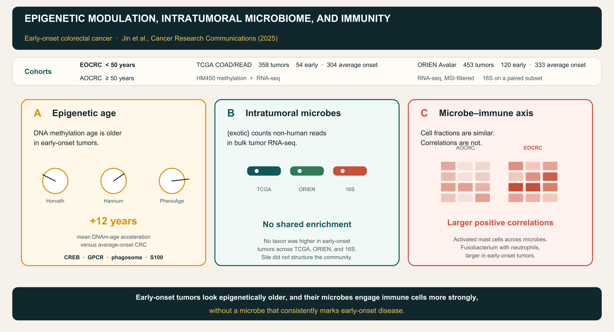

# exorien-exogieo [](https://doi.org/10.5281/zenodo.16951170)

<p align="center">
  
</p>

Analysis, figures, and tables for the early-onset colorectal cancer (EOCRC) study of DNA methylation, the intratumoral microbiome, and tumor immune-cell composition. Microbial abundances were estimated from bulk tumor RNA-seq with [{exotic}](https://github.com/spakowiczlab/exotic) and checked against 16S rRNA gene counts from a paired subset of the same tumors.

<p align="center">
  
</p>

EOCRC is age at diagnosis under 50 years. Average-onset colorectal cancer (AOCRC) is age at diagnosis of 50 years or older. The Cancer Genome Atlas (TCGA) contributes 358 colon and rectal tumors with HumanMethylation450 and RNA-seq (54 EOCRC; the results text compares these with 304 AOCRC, and Table 1 lists 303 AOCRC rows with complete clinical fields). The Oncology Research Information Exchange Network (ORIEN) Avatar cohort contributes 453 colorectal tumors with RNA-seq after microsatellite-unstable cases were removed (120 EOCRC and 333 AOCRC). A 16S amplicon set that partially overlaps ORIEN is the orthogonal check on the RNA-seq microbes. The manuscript also sets aside microsatellite-unstable TCGA cases before the methylation and microbiome comparisons. MSI, *POLE*, and *POLD1* flags for the 358-sample key remain in `data/key_all-sample-ids-with-pnt-barcodes-msi_pole_pold_status_358.txt`.

## Citation

Jin N, Hoyd R, Yilmaz AS, Zhu J, Liu Y, Jagjit Singh MS, Grencewicz DJ, Mo X, Kalady MF, Rosenberg DW, Dravillas CE, Singer EA, Carpten JD, Chan CHF, Churchman ML, Denko N, Di Clemente F, Dodd RD, Eljilany I, Fei N, Hardikar S, Ikeguchi AP, Ma A, Ma Q, McCarter MD, Osman AEG, Riedlinger G, Robinson LA, Schneider BP, Tarhini AA, Tinoco G, Figueiredo JC, Zakharia Y, Ulrich CM, Tan AC, Spakowicz D. Epigenetic modulation, intratumoral microbiome, and immunity in early-onset colorectal cancer. *Cancer Research Communications*. 2025;5(11):1985–1997. doi:[10.1158/2767-9764.CRC-25-0177](https://doi.org/10.1158/2767-9764.CRC-25-0177). PMID:[41134679](https://pubmed.ncbi.nlm.nih.gov/41134679/).

Corresponding author: Ning Jin, Division of Medical Oncology, The Ohio State University Comprehensive Cancer Center (Ning.Jin2@osumc.edu).

Preprint: Jin et al. bioRxiv. 2025. doi:[10.1101/2025.03.28.645992](https://doi.org/10.1101/2025.03.28.645992).

Archived snapshot of this repository: doi:[10.5281/zenodo.16951170](https://doi.org/10.5281/zenodo.16951170).

The article reports processed data under BioProject [PRJNA856973](https://www.ncbi.nlm.nih.gov/bioproject/PRJNA856973). ORIEN Avatar sequencing and clinical data were generated under the Total Cancer Care protocol (ClinicalTrials.gov [NCT02482610](https://clinicaltrials.gov/study/NCT02482610); Ohio State IRB 2015H0088).

## Companion papers

This repository is one of a set of manuscripts submitted to *Cancer Research Communications*. Each study calls the same tool, [{exotic}](https://github.com/spakowiczlab/exotic) (“exogenous sequences in tumors and immune cells”), to estimate microbe abundances from tumor RNA-seq.

| Repository | Paper | Role of {exotic} |
| --- | --- | --- |
| [spakowiczlab/exotic](https://github.com/spakowiczlab/exotic) and [spakowiczlab/exotic-manuscript](https://github.com/spakowiczlab/exotic-manuscript) | Hoyd R, Wheeler CE, Liu Y, Jagjit Singh MS, Muniak M, Jin N, Denko NC, Carbone DP, Mo X, Spakowicz DJ. Exogenous sequences in tumors and immune cells (exotic): a tool for estimating the microbe abundances in tumor RNA-seq data. *Cancer Research Communications*. 2023;3(11):2375–2385. doi:[10.1158/2767-9764.CRC-22-0435](https://doi.org/10.1158/2767-9764.CRC-22-0435). | Method. Builds the unnormalized microbe count tables used here. |
| [spakowiczlab/exorien-melio](https://github.com/spakowiczlab/exorien-melio) | Wheeler CE, Coleman SS, et al. The tumor microbiome as a predictor of outcomes in patients with metastatic melanoma treated with immune checkpoint inhibitors. *Cancer Research Communications*. 2024;4(8):1978–1990. doi:[10.1158/2767-9764.CRC-23-0170](https://doi.org/10.1158/2767-9764.CRC-23-0170). | Melanoma RNA-seq, immune checkpoint inhibitors. |
| [spakowiczlab/exorien-recrad](https://github.com/spakowiczlab/exorien-recrad) | Benej M, Hoyd R, et al. The tumor microbiome reacts to hypoxia and can influence response to radiation treatment in colorectal cancer. *Cancer Research Communications*. 2024;4(7):1690–1701. doi:[10.1158/2767-9764.CRC-23-0367](https://doi.org/10.1158/2767-9764.CRC-23-0367). | Colorectal RNA-seq, hypoxia, radiotherapy. |
| [spakowiczlab/exorien-exogieo](https://github.com/spakowiczlab/exorien-exogieo) (this repo) | Jin et al., 2025, citation above. | Colorectal RNA-seq and 16S, methylation age, EOCRC versus AOCRC. |

Install and run details for the counter itself live in the [{exotic} package repository](https://github.com/spakowiczlab/exotic). This repository starts from {exotic} count tables that were already written.

## Raw microbe counts

Two count layers feed every microbiome figure. The 16S counts are in this git checkout. The RNA-seq counts are the unnormalized {exotic} matrices on the Ohio Supercomputer Center (OSC) project `PAS1695`. Differential abundance uses those unnormalized counts. Relative-abundance tables are a later transform and are the wrong input for DESeq2.

### 16S counts in this repository

`data/16s_counts_long.csv` is the committed 16S count table. It has 1,319 rows, 53 samples, and 171 species-level taxa (`taxonomy_lvl` = `S`).

| Column | Meaning |
| --- | --- |
| `name` | Taxon name, Kraken-style punctuation preserved. |
| `taxonomy_id` | NCBI taxonomy id. |
| `taxonomy_lvl` | Rank code. Every row in this file is species (`S`). |
| `kraken_assigned_reads` | Reads Kraken assigned directly to that taxon. This is the raw assignment count. |
| `added_reads` | Reads redistributed down from higher ranks (Bracken-style). |
| `new_est_reads` | `kraken_assigned_reads` + `added_reads`. Downstream 16S scripts rename this column to `counts`. |
| `fraction_total_reads` | Estimated reads as a fraction of the sample total. |
| `sample` | 16S sample id. Join to RNA-seq and specimen type through `data/16s_sample_matching.csv`. |

`data/16s_sample_matching.csv` has 75 `samp16s` ids (31 tumor, 31 adjacent normal, 13 controls) and links `patient.id`, specimen type, and `RNAseq` when a pair exists. The manuscript describes 16S from 60 samples that partially overlap ORIEN. The long count file is the species table actually read by the distance and stacked-bar code.

Scripts that consume `new_est_reads` from this file:

- `scripts/16s_distance_boxplot.Rmd` and `scripts/analysis-scripts/distanceBoxplot.R`
- `scripts/analysis-scripts/validate16sStackedBar.R`
- `scripts/figure_3.Rmd` (through the cached objects those functions write)

`scripts/eo-lo_ORIEN_16s.Rmd` and `scripts/analysis-scripts/calcL2FC.R` still point at a wide table, `16s_taxa_allLevels_counts_wide.csv`, that is not committed. The fitted early-versus-average model from that script is committed as `data/16s_modelling_eo-lo.csv`. Rebuild the wide table from `16s_counts_long.csv` if you need to rerun the model from counts.

### RNA-seq microbe counts from {exotic}

These files are the raw (unnormalized) microbe counts after the human-RNA filter, with taxonomy columns attached. They are not in git yet. Gzip each CSV and commit the `.csv.gz` under `data/` (GitHub rejects a single file over 100 MB). `data.table::fread()` and `readr::read_csv()` open `.csv.gz` directly. The scripts still point at the cluster paths below.

| Commit as | Source on OSC |
| --- | --- |
| `data/2022-03-16_unnormalized-microbes_humanRNAfilt_w_taxonomy.csv.gz` | `/fs/ess/PAS1695/projects/exorien/data/drake-output/2022-03-16/2022-03-16_unnormalized-microbes_humanRNAfilt_w_taxonomy.csv` |
| `data/2022-03-16_TCGA_unnormalized-microbes_humanRNAfilt_w_taxonomy.csv.gz` | `/fs/ess/PAS1695/projects/exorien/data/drake-output/2022-03-16/2022-03-16_TCGA_unnormalized-microbes_humanRNAfilt_w_taxonomy.csv` |
| `data/2022-03-16_unnorm-mics_filt.csv.gz` | `/fs/ess/PAS1695/projects/exogieo/data/ORIEN-processing/2022-03-16_unnorm-mics_filt.csv` |

- `2022-03-16_unnormalized-microbes_humanRNAfilt_w_taxonomy.csv` is the ORIEN unnormalized {exotic} table. It is the input to the ORIEN DESeq2, correlation, beta-diversity, and *Fusobacterium* scripts.
- `2022-03-16_TCGA_unnormalized-microbes_humanRNAfilt_w_taxonomy.csv` is the TCGA unnormalized {exotic} table. It is the input to the TCGA correlation, beta-diversity, and *Fusobacterium* scripts.
- `2022-03-16_unnorm-mics_filt.csv` is that TCGA table filtered to the 358 methylation-matched samples. `scripts/processing_generate-dataset.Rmd` writes it. The directory name on OSC is `ORIEN-processing`; the rows are TCGA. This is the count matrix for the TCGA DESeq2 volcano.

If a gzipped file is still over 100 MB, keep the colorectal samples only (ORIEN ids in `data/clinical_ORIEN_curated.csv`, TCGA ids in `data/key_all-sample-ids-with-pnt-barcodes-msi_pole_pold_status_358.txt`), drop zero counts, and store taxonomy once beside a `sample`, `microbe`, `counts` table.

Relative abundance, when a script needs it, is computed in place as microbe `counts` divided by the *Homo sapiens* `counts` on the same sample (`RA = counts / Hs.counts` in `scripts/corrs_mic-gene-immune_TCGA.Rmd` and `scripts/corrs_mic-gene-immune_ORIEN-data.Rmd`). The precomputed relative-abundance extracts are also still on OSC:

| Commit as | Source on OSC |
| --- | --- |
| `data/2022-03-16_TCGA_RA-with-taxonomy_COAD.csv.gz` | `/fs/ess/PAS1695/projects/exorien/data/drake-output/2022-03-16/2022-03-16_TCGA_RA-with-taxonomy_COAD.csv` |
| `data/2022-03-16_TCGA_RA-with-taxonomy_READ.csv.gz` | `/fs/ess/PAS1695/projects/exorien/data/drake-output/2022-03-16/2022-03-16_TCGA_RA-with-taxonomy_READ.csv` |
| `data/2022-03-16_RA-with-taxonomy.csv.gz` | `/fs/ess/PAS1695/projects/exogieo/data/ORIEN-processing/2022-03-16_RA-with-taxonomy.csv` |

`2022-03-16_RA-with-taxonomy.csv` is COAD and READ bound, then filtered to the methylation sample key.

`scripts/MANIFEST.txt` is a manifest of human STAR gene-count TSVs (`*.rna_seq.augmented_star_gene_counts.tsv`), with GDC-style ids, md5 sums, and file sizes. Those are host expression files. The microbe counts are the tables above.

## What each script does

Open `exorien-exogieo.Rproj` and run the R Markdown files from `scripts/` so that `../data` and `../figures` resolve. Anything under `/fs/ess/PAS1695/` or `/fs/scratch/PAS1695/` needs OSC.

### Cohort construction

| Script | Reads | Writes |
| --- | --- | --- |
| `scripts/processing_pull-ORIEN-clinical.Rmd` | ORIEN {exotic} relative-abundance tables and the Aster Insights clinical extracts on OSC | `data/clinical_ORIEN.csv` |
| `scripts/processing_generate-dataset.Rmd` | TCGA {exotic} counts and expression, plus `data/key_all-sample-ids-with-pnt-barcodes-msi_pole_pold_status_358.txt` | Filtered TCGA count and expression tables under `/fs/ess/PAS1695/projects/exogieo/data/ORIEN-processing/`, including `2022-03-16_unnorm-mics_filt.csv` |
| `scripts/table-1_ORIEN.Rmd` | `data/clinical_ORIEN.csv` and the OSC TCGA clinical file | `tables/tab1_ORIEN.csv`, `tables/tab1_ORIEN_condensed.csv`, `tables/tab1_TCGA_condensed.csv`, `data/clinical_ORIEN_curated.csv`, `data/clinical_TCGA_curated.csv` |

`data/key_all-sample-ids-with-pnt-barcodes-msi_pole_pold_status_358.txt` is the TCGA sample crosswalk: patient barcode, expression file id, microbe sample id, methylation file id, MSI panel status, and *POLE*/*POLD1* mutation flags.

### Early-onset versus average-onset microbes

| Script | Reads | Writes |
| --- | --- | --- |
| `scripts/eo-lo_deseq2_volcano-and-lda.Rmd` | TCGA filtered unnormalized counts (`2022-03-16_unnorm-mics_filt.csv`) and `data/clinical_TCGA_curated.csv` | `data/deseq2_all-cohort.csv`, `figures/volcano_deseq2-allsamps.png`, `figures/LDA_deseq2_5t.png`, `figures/LDA_deseq2_10t.png` |
| `scripts/eo-lo_ORIEN-data.Rmd` | ORIEN unnormalized counts and `data/clinical_ORIEN_curated.csv` | `data/deseq2_all-cohort_ORIEN-data.csv`, `figures/volcano_ORIEN-data_deseq2-allsamps.png`, `figures/LDA_ORIEN-data_deseq2_{5,10,15}t.png` |
| `scripts/eo-lo_ORIEN_16s.Rmd` | Wide 16S counts (see the raw-count note) and the OSC 16S clinical workbooks | `data/16s_modelling_eo-lo.csv` |
| `scripts/comparisons_eo-v-lo_tcga-orien-16s.Rmd` | The three result tables above | `figures/euler_dataset-taxa-overlap.pdf`, `figures/upset_eo-lo-res.png`, `figures/volcano_facetted-datasets.png`, `figures/LDA_facetted-datasets.png` |
| `scripts/summarise_deseq-across-datasets.Rmd` | The same three result tables | Summary used while comparing cohorts. Its 16S path is `../../../data/16s_modelling_eo-lo.csv`; the committed file is `data/16s_modelling_eo-lo.csv`. |
| `scripts/stacked-bar.Rmd` | TCGA filtered unnormalized counts | `figures/stacked-bar_microbes_domain.png` |
| `scripts/beta-div_primary-sites.Rmd` | ORIEN and TCGA unnormalized counts, curated clinical tables | `figures/nmds_ORIEN-betadiv.png`, `figures/nmds_TCGA-betadiv.png` |

DESeq2 is run separately at each rank from domain through genus. The saved result tables stack those ranks and carry `Taxa`, `Taxa.Level`, `log2FoldChange`, `baseMean`, `lfcSE`, `stat`, `pvalue`, and `padj`. The 16S model table uses a binomial early-versus-average term and stores `estimate`, `std.error`, `statistic`, `p.value`, `microbe`, and `padj`.

### 16S validation of the RNA-seq microbes

| Script | Reads | Writes |
| --- | --- | --- |
| `scripts/16s_distance_boxplot.Rmd` | `data/16s_counts_long.csv` (`new_est_reads`), `data/16s_sample_matching.csv`, ORIEN {exotic} counts, and the Kraken/MetaPhlAn taxonomy map on OSC | `data/16s_distances.csv`, `figures/16s_distance_boxplot.png` |
| `scripts/analysis-scripts/validate16sStackedBar.R` | The same 16S long counts plus both RNA-seq count tables | Phylum composition used in Figure 3 |
| `scripts/prepare-figure-data.R` | Sources every file in `scripts/analysis-scripts/` | The `.rda` files in `data/prepared-figure-data/` |

`data/16s_distances.csv` holds the pairwise distances behind the paired-versus-unpaired violin plot (same tumor across 16S and RNA-seq, versus different tumors, adjacent normal, and negative controls).

### Methylation

Methylation beta values are on OSC, not in git: `/fs/ess/PAS1695/projects/exogieo/data/coad_read_methylation_assay_combatcorrected_betavalues_358samples.csv` (ComBat-corrected HM450 betas, 358 samples).

| Script | Role |
| --- | --- |
| `scripts/corrs_methyl-microbe.Rmd` | Correlates genus-level microbes with the most variable methylation sites. Can write `data/correlations_microbes-with-methylation.csv`. Draws `figures/histogram_genera-methyl-corr.pdf`. |
| `scripts/methyl-expr-integration.Rmd` | Joins differential methylation to differential expression (starburst / pathway comparison). |
| `scripts/exploratory_map-methyl-genes.Rmd` | Maps the saved methylation–microbe correlations onto genes. |

Epigenetic-clock estimates (Horvath, Hannum, PhenoAge) are described in the paper and summarized on the graphical abstract. The clock calculation itself is upstream of the files in this checkout.

### Microbes, gene expression, and immune cells

Immune fractions in the paper are CIBERSORTx. The raw deconvolution outputs are on OSC:

- ORIEN: `/fs/ess/PAS1695/projects/exorien/data/cibersort/2022-03-16_immunecell_composition.csv`
- TCGA: `/fs/ess/PAS1695/projects/exogieo/data/drake-output/2021-02-15_tcga_immune-cell-fractions.csv`

`scripts/tables_supplement.Rmd` defines `loadORIENImmune()` and `loadTCGAimmune()`, subsets them to the curated cohorts, and writes `tables/s8_orien-immune-frac.csv` and `tables/s9_tcga-immune-frac.csv`.

| Script | Reads | Writes |
| --- | --- | --- |
| `scripts/corrs_mic-gene-immune_ORIEN-data.Rmd` | ORIEN unnormalized counts, aggregated expression, curated clinical, CIBERSORTx | `figures/correlation-heatmap_microbes-with-TILs_ORIEN.png`, `figures/correlation-heatmap_microbe-expression_ORIEN.png`. Correlation jobs also land in `/fs/ess/PAS1695/projects/exogieo/data/correlation-data/ORIEN-results_{1,2}.csv`. |
| `scripts/corrs_mic-gene-immune_TCGA.Rmd` | TCGA unnormalized counts, TCGA expression, curated clinical, CIBERSORTx | The matching TCGA heatmaps and `TCGA-results_{1,2}.csv`. |
| `scripts/corr-functions_ORIEN.R`, `scripts/corr-functions_TCGA.R` | Helpers that write those correlation-result CSVs. | |
| `scripts/corrs_compare-TCGA-ORIEN.Rmd` | The ORIEN and TCGA correlation results | One scatter per immune cell in `figures/scatterplots_mic-immune/` and one per gene in `figures/scatterplots_mic-gene/`. |
| `scripts/boxplots_immune-cell-fractions.Rmd` | `tables/s8_orien-immune-frac.csv`, `tables/s9_tcga-immune-frac.csv`, curated clinical | `figures/boxplot_ORIEN_immune-age.png`, `figures/boxplot_TCGA_immune-age.png` |
| `scripts/immune_alt-deconvs.Rmd` | Expression counts formatted for TIMER, then compared with CIBERSORTx | `tables/compare-deconv-results.csv` |

Pooled correlation tables committed for reuse:

- `data/correlations_microbes-with-TILs_all.csv` — Spearman rho of genus-level microbes versus CIBERSORTx fractions, with `im.cell`, `microbe`, `onset` (`EO` or the average-onset label), `estimate`, `statistic`, `p.value`.
- `data/correlations_microbes-with-expressions_all.csv` — the same layout for genes.
- `data/correlations_microbes-with-methylation.csv` — microbes versus methylation sites.

### *Fusobacterium* follow-up

| Script | Writes |
| --- | --- |
| `scripts/processing_fubacterium-groups.Rmd` | `data/fusobacterium_clinical-groups.csv` (per-sample species abundances, stage, onset, dataset) and `figures/fusobacterium_boxplot_orien-tcga.png` |
| `scripts/exploratory_fusobacteriales-extended.Rmd` | `data/deseq2_fusobacteriales-expression.csv`, `data/fgsea_fuso-prev.csv` |
| `scripts/modelling_fusobacterium-multivariate.Rmd` | Multivariate models. A rendered copy is `scripts/modelling_fusobacterium-multivariate.html`. |

### Manuscript figures from cached objects

`scripts/prepare-figure-data.R` rebuilds the caches. After that, these notebooks only `load()` local `.rda` files, so they rerun without OSC:

| Script | Cache | Figure |
| --- | --- | --- |
| `scripts/figure_3.Rmd` | `euler_taxalist.rda`, `distances_16s.rda`, `stackedbar_16s.rda`, `vol-lda.rda` | Figure 3: taxon overlap, 16S–RNA-seq distances, phylum stacked bar, faceted volcano, faceted LDA |
| `scripts/figure_4.Rmd` | `heatmap_corrs.rda` | Figure 4: microbe–immune heatmap, neutrophil and activated-mast-cell scatters (PNG and SVG) |
| `scripts/figure_supplement.Rmd` | `scatterplot_corrs.rda` | `figures/scatterplot_all-mic-immune_sup.png` |
| `scripts/tables_supplement.Rmd` | `vol-lda.rda`, `scatterplot_corrs.rda` | Supplementary tables S6, S7, and S10. S8 and S9 still read the OSC CIBERSORTx files. |
| `scripts/figures_hex-and-abstract.R` | none | `figures/hex_exogieo.png`, `figures/graphical_abstract.png` |

`figures/man1_1A_stacked-bar_microbes_domain.png` is a manuscript export of the domain stacked bar. The scripted version is `figures/stacked-bar_microbes_domain.png`.

Per-cell and per-gene scatters from `corrs_compare-TCGA-ORIEN.Rmd` are already rendered under `figures/scatterplots_mic-immune/` and `figures/scatterplots_mic-gene/`.

## Supplementary tables

| File | Paper table | Contents |
| --- | --- | --- |
| `tables/tab1_TCGA_condensed.csv` | Table 1 | TCGA clinical characteristics by onset. |
| `tables/tab1_ORIEN.csv`, `tables/tab1_ORIEN_condensed.csv` | Table 2 | ORIEN clinical characteristics by onset. The condensed file is the published layout. |
| `tables/s6_fig3-rnaseq-vol.xlsx` | Supplementary Table S6 | DESeq2 log2 fold changes and adjusted *P* values for TCGA and ORIEN RNA-seq microbes, one sheet per dataset. |
| `tables/s7_fig-16s-vol.xlsx` | Supplementary Table S7 | 16S early-versus-average model coefficients. |
| `tables/s8_orien-immune-frac.csv` | Supplementary Table S8 | CIBERSORTx fractions for the ORIEN analysis cohort. |
| `tables/s9_tcga-immune-frac.csv` | Supplementary Table S9 | CIBERSORTx fractions for the TCGA analysis cohort. |
| `tables/s10_correlation-summary.xlsx` | Supplementary Table S10 | Microbe–immune correlations, one sheet per cell type. |
| `tables/compare-deconv-results.csv` | Deconvolution check | Correlation of TIMER estimates with CIBERSORTx. |

## Reproduce the figures

From a machine that already has the caches in `data/prepared-figure-data/`:

```r
# working directory: scripts/
rmarkdown::render("figure_3.Rmd")
rmarkdown::render("figure_4.Rmd")
rmarkdown::render("figure_supplement.Rmd")
rmarkdown::render("tables_supplement.Rmd")  # S6, S7, S10 locally; S8 and S9 need OSC
rmarkdown::render("boxplots_immune-cell-fractions.Rmd")
```

Redraw the sticker and graphical abstract from the repository root:

```bash
Rscript scripts/figures_hex-and-abstract.R
```

Full regeneration, starting from reads:

1. Run [{exotic}](https://github.com/spakowiczlab/exotic) on the ORIEN and TCGA RNA-seq to produce the 2022-03-16 unnormalized count tables named above. The method paper and `exotic-manuscript` document contaminant filtering and the human-RNA filter.
2. `scripts/processing_pull-ORIEN-clinical.Rmd` then `scripts/table-1_ORIEN.Rmd` to refresh the clinical tables.
3. `scripts/processing_generate-dataset.Rmd` to refresh the methylation-matched TCGA count matrix (`2022-03-16_unnorm-mics_filt.csv`).
4. `scripts/eo-lo_deseq2_volcano-and-lda.Rmd`, `scripts/eo-lo_ORIEN-data.Rmd`, and `scripts/eo-lo_ORIEN_16s.Rmd` to refresh differential abundance. For 16S, start from `data/16s_counts_long.csv` and use `new_est_reads`.
5. `scripts/corrs_mic-gene-immune_ORIEN-data.Rmd` and `scripts/corrs_mic-gene-immune_TCGA.Rmd` to refresh correlations. These are the long jobs; the notebooks can also reload the CSVs already written under `correlation-data/`.
6. `scripts/prepare-figure-data.R` to refresh `data/prepared-figure-data/`.
7. The figure and table notebooks in the block above.

R packages used across the notebooks include tidyverse, DESeq2, vegan, eulerr, ggrepel, glmm, broom, readxl, and writexl. The sticker script also uses hexSticker, ggplot2, grid, and showtext.

## Layout

```
exorien-exogieo
├── data
│   ├── 16s_counts_long.csv          # 16S raw and estimated read counts
│   ├── 16s_sample_matching.csv
│   ├── 16s_distances.csv
│   ├── 16s_modelling_eo-lo.csv
│   ├── clinical_ORIEN.csv
│   ├── clinical_ORIEN_curated.csv
│   ├── clinical_TCGA_curated.csv
│   ├── deseq2_all-cohort.csv        # TCGA RNA-seq
│   ├── deseq2_all-cohort_ORIEN-data.csv
│   ├── correlations_microbes-with-*.csv
│   └── prepared-figure-data/        # objects behind Figures 3 and 4
├── figures
│   ├── hex_exogieo.png
│   └── graphical_abstract.png
├── scripts
│   ├── analysis-scripts/            # functions sourced by prepare-figure-data.R
│   ├── MANIFEST.txt                 # human STAR gene-count manifest
│   └── *.Rmd
├── tables
├── LICENSE
└── exorien-exogieo.Rproj
```

## License

MIT. Copyright (c) 2025 Spakowicz Lab. See [LICENSE](LICENSE).
